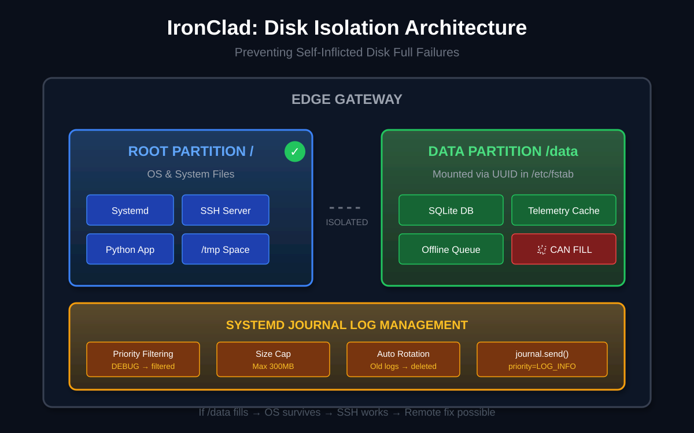

# Project IronClad

A self-healing IIoT edge gateway for remote industrial environments.

---

## Architecture



```
┌─────────────────────────────────────────────────────┐
│                   HARDWARE LAYER                     │
│              Kernel Watchdog (softdog)               │
│         Physical reboot if OS hangs >20s             │
└─────────────────────┬───────────────────────────────┘
                      │
┌─────────────────────▼───────────────────────────────┐
│                   PROCESS LAYER                      │
│                     Systemd                          │
│  • WatchdogSec=60    • Restart=on-failure           │
│  • StartLimitBurst=5 • OnFailure=recovery.service   │
└─────────────────────┬───────────────────────────────┘
                      │
┌─────────────────────▼───────────────────────────────┐
│                 APPLICATION LAYER                    │
│                 Python Telemetry                     │
│  • sd_notify(READY/WATCHDOG)  • SQLite persistence  │
│  • journal.send() logging     • Encrypted creds     │
└─────────────────────────────────────────────────────┘
```

---

## The Problem

In Oil & Gas, a frozen gateway means a blind spot on a multimillion-dollar asset. Sending a technician to reboot a device on an offshore rig can cost thousands.

## The Solution

IronClad detects failures in seconds and recovers without human intervention—watchdog heartbeats, automatic restarts, and alerts when something's wrong.

---

## Key Results

| Metric             | Value             |
| ------------------ | ----------------- |
| Freeze detection   | 60 seconds        |
| Service restart    | ~4 seconds        |
| Alert trigger      | After 5 failures  |
| Data loss on crash | Zero (SQLite WAL) |

---

## Features

### Self-Healing Process Management

- Systemd `Type=notify` integration—service signals when ready
- Watchdog heartbeat every 60 seconds—freeze detected, service restarted
- Circuit breaker after 5 failures triggers SMTP alert
- Hardware watchdog reboots device if OS hangs

### Data Persistence (Store & Forward)

- SQLite-backed buffering—writes to disk immediately
- Separate `/data` partition—database fills up, OS survives
- Zero data loss on crash or power failure

### Log Management

- Systemd Journal with priority levels—debug filtered, critical alerts
- 300MB cap with automatic rotation
- Prevents "Disk Full" bricking

### Encrypted Credentials

- `LoadCredentialEncrypted`—secrets injected at runtime
- Encrypted at rest, never in plain text
- Aligns with ISA/IEC 62443

### Resource Optimization

- `Nice=-10` CPU priority for telemetry
- Runs on low-cost edge hardware

---

## Installation

### Prerequisites

- Ubuntu 22.04+ or Debian 12+
- Python 3.10+
- systemd 250+ (for credential encryption)
- Root access

### 1. Clone and Install Dependencies

```bash
git clone https://github.com/yourusername/ironclad.git
cd ironclad

# Install Python packages
pip install systemd-python

# Optional: for email alerts
pip install secure-smtplib
```

### 2. Create Directory Structure

```bash
# Application directory
sudo mkdir -p /opt/iiot_edge
sudo cp src/telemetry.py /opt/iiot_edge/
sudo cp src/sos_alert.py /opt/iiot_edge/

# Create separate data partition (recommended for production)
# For testing, just create the directory:
sudo mkdir -p /data
sudo chown $USER:$USER /data
```

### 3. Set Up Hardware Watchdog

```bash
# Load kernel watchdog module
sudo modprobe softdog

# Make persistent across reboots
echo "softdog" | sudo tee /etc/modules-load.d/softdog.conf
```

### 4. Configure Email Alerts (Optional)

```bash
# Create encrypted credential for email password
echo -n "your-app-password" | sudo systemd-creds encrypt \
    --name=EMAIL_PASSWORD - \
    /etc/credstore.encrypted/EMAIL_PASSWORD.cred

# Edit sos_alert.py with your email settings
sudo nano /opt/iiot_edge/sos_alert.py
```

### 5. Install and Enable Services

```bash
# Copy service files
sudo cp systemd/*.service /etc/systemd/system/

# Reload and enable
sudo systemctl daemon-reload
sudo systemctl enable --now ironclad.service
```

---

## Usage

```bash
# Check status
systemctl status ironclad.service

# View logs (follow mode)
journalctl -u ironclad.service -f

# Query telemetry data
sqlite3 /opt/iiot_edge/data.db "SELECT * FROM readings ORDER BY ts DESC LIMIT 10;"

# Test crash recovery
touch /opt/iiot_edge/trigger_crash

# Test freeze recovery
touch /opt/iiot_edge/trigger_freeze
```

---

## File Structure

```
/etc/systemd/system/
├── ironclad.service          # Main telemetry service
├── ironclad-recovery.service # SMTP alert on failure

/opt/iiot_edge/
├── telemetry.py              # Main application
├── sos_alert.py              # Email alert script

/data/
└── telemetry.db              # SQLite store (separate partition)

/etc/credstore.encrypted/
└── EMAIL_PASSWORD.cred       # Encrypted credentials
```

---

## Tech Stack

- Python 3
- Systemd (notify, watchdog, journal, credentials)
- SQLite (WAL mode)
- Kernel watchdog (softdog)
- SMTP

---

## What I Learned

I'm in the Linux fundamentals phase of my journey toward Oil & Gas digital infrastructure. This project taught me that reliability isn't about code that doesn't crash—it's about systems that survive when it does.

---

## License

MIT
